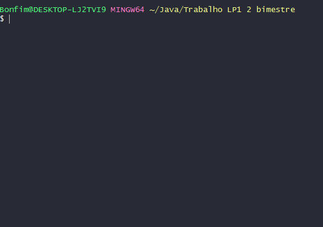
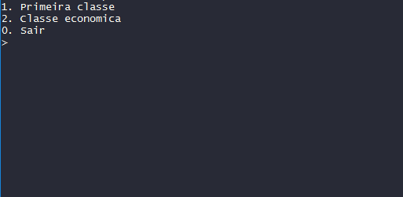

# Sistema para reserva de passagens aéreas

Uma pequena companhia aérea acabou de comprar um computador para seu novo sistema automatizado de reservas. Você foi solicitado a desenvolver o novo sistema. Você escreverá um aplicativo para atribuir assentos em cada voo da companhia aérea (capacidade: 10 assentos). 

Seu aplicativo deve exibir as seguintes alternativas: digite 1 para Primeira classe e 2 para Classe econômica. Se o usuário digitar 1, seu aplicativo deve atribuir assentos na primeira classe (poltronas 1 - 5). Se o usuário digitar 2, seu aplicativo deve atribuir um assento na classe econômica (poltronas 6 - 10). Seu aplicativo deve exibir um cartão de embarque indicando o número da poltrona da pessoa e se ela está na primeira classe ou na classe econômica.

Utilize um array unidimensional (vetor) do tipo primitivo boolean para representar o gráfico de assentos do avião. Inicialize todos os elementos do array como false para indicar que todas as poltronas estão desocupadas. À medida que cada assento é atribuído, configure o elemento correspondente do array como true para indicar que o assento não está mais disponível.

Seu aplicativo nunca deve atribuir uma poltrona que já foi reservada. Quando a classe econômica estiver lotada, seu aplicativo deve perguntar à pessoa se ela aceita ficar na primeira classe (e vice-versa). Se a pessoa aceitar, faça a atribuição apropriada de assento. Se não aceitar, exiba a mensagem “O próximo voo parte em 3 horas”.

***

### Funcionamento

* Escolha da Poltrona desejada:



* Caso o usuário escolha uma poltrona já ocupada:




***

### Instalação / Execução

Requisitos: [Java Development Kit](https://www.oracle.com/technetwork/java/javase/downloads/index.html)

* Salve o arquivo Main.java em alguma pasta de sua preferência;

* Abra um terminal de comando e navegue até a pasta onde você salvou o arquivo;

* Execute os seguintes comandos:

```
javac Main.java
java Main
```


